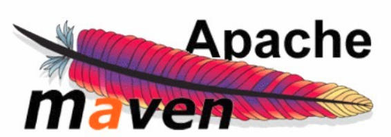
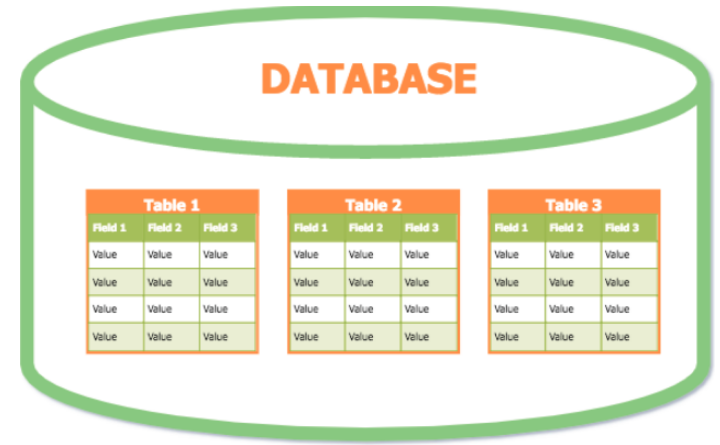
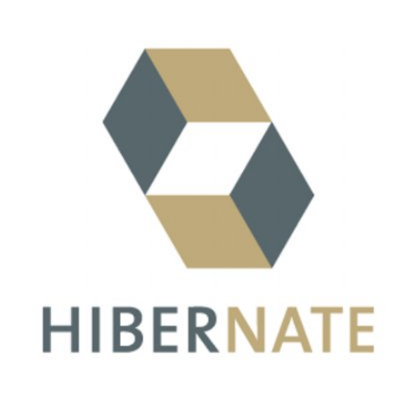
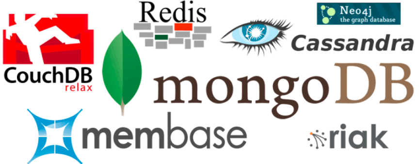

# Globant Java Bootcamp 2018
## Spring - REST - Git - Maven - Testing


## __IMPORTANT DISCLAIMER__
This is not your typical _crash course_, this is a **Bootcamp**.

What does that mean?

- _You will give your best_

- _We will give our best_

- _We will all have a good time_


But most important, there will be **A LOT** of humor, because a happy developer _(student, pupil, padawan, you get the point...)_ is a great and hard working developer.


_That said..._

## Welcome to the bootcamp, learning time has begun


Please, use this repository as a base for you training phase. The idea is to
fork this project so everyone use the same folder structure for the
exercises.

It's extremelly important to keep the key points easy to be verified by
the reviewers, so **don't mix the key points with the rest of the
exercises**

# Material

## JAVA Bootcamp

### Are you ready for it?
  
### Index

1. [Objective](#objective)

2. [Who Should Attend](#who-should-attend)

3. [Duration](#duration)

4. [Technical Assistance](#technical-assistance)

5. [Performance Measurement](#performance-measurement)

6. [Handling advanced Developers](#handling-advanced-developers)

7. [Materials](#materials)

8. [General Guidelines](#general-guidelines)

9. [Learning Days](#learning-days)

    * [Topic 0: Introduction to Object Oriented Programming Concepts (OOP)](#topic-0-introduction-to-object-oriented-programming-concepts)

    * [Topic 1: Git](#topic-1-git)

    * [Topic 2: Maven](#topic-2-maven)

    * [Topic 3: Arrays, Generics and Collections](#topic-3-arrays-generics-and-collections)

    * [Topic 4: Spring](#topic-4-spring-core)

    * [Topic 5: Web Services](#topic-5-web-services-rest)

    * [Topic 6: Relational Databases](#topic-6-rdbs)

    * [Topic 7: Hibernate](#topic-7-hibernate-jpa)

    * [Topic 8: Testing](#topic-8-testing)
    
    * [Topic 9: Java 8, 9 and 10](#topic-9-java-8-9-and-10)

    * [Topic 10: Concurrency](#topic-10-concurrency)

### Objective

This course teaches the basics of Java development applications with the complementary stack needed for a real project.

→ [index](#index)

### Who Should Attend

The training will start at a low level and does not require in depth knowledge of the platform in question. A basic knowledge on OOP is desired, though. Any additional knowledge is benefitial, especially Java/Spring related.

→ [index](#index)

### Duration

Six weeks total.

You will attend Globant once a week for a one-hour lecture on **Wednesdays 15hs**. 

Meetings with the client will be scheduled during the course once/twice a week.

→ [index](#index)

### Technical Assistance

You can contact other Bootcamp participants or any available tutor if you need
technical assistance. Communications will take place over [Slack](https://slack.com/features) on our own [Bootcamp Workspace](https://globant-bootcamps2018.slack.com/)

→ [index](#index)

### Performance Measurement

1. Code review after each practice.

2. Checkpoint completion after Learning stage with your assigned tutor.

3. Final Application for fictitious client during Bootcamp.

4. Group work performance.

→ [index](#index)


### Handling Advanced Developers

Developers that move faster than average can go ahead and complete as much exercises as wanted. Additional tools or frameworks can be used if you think that's necessary.

→ [index](#index)

### Materials

1. Laptop (Globant will not provide it).

2. Install [Java 8 SDK](http://www.oracle.com/technetwork/java/javase/downloads/jdk8-downloads-2133151.html).

3. You can choose whichever IDE you want, it could be [Eclipse for Java Developers](http://www.eclipse.org/downloads/), [IntelliJ Idea](https://www.jetbrains.com/idea/).

4. Slack Account + headset (For eventual zoom audio calls). Please, upload a profile photo to your Slack account so we can easily associate your face with your name.

5. Create your own [GitHub](https://github.com/) account. Follow this [guideline](https://help.github.com/articles/set-up-git) to setup your account. Also you can read further about Git in [Try Git](https://try.github.io/levels/1/challenges/1) or [Learn Git Branching](http://pcottle.github.io/learnGitBranching/).

6. Fork this repo https://github.com/ilanrosenfeld7/globant-bootcamps-java to use as a base to host the project code. Read [this](https://help.github.com/articles/fork-a-repo/) for instructions.

→ [index](#index) 


### General Guidelines

1. [Team play](http://www.dummies.com/how-to/content/ten-qualities-of-an-effective-team-player.html) is encouraged but the work will be evaluated per person.

2. The instructions will be vague as they generally are in real life projects.
You must look for support and guidance from your PM, teammates and tutors.

3. All code and documentation must be in English.

4. Every additional feature acts like a bonus. If you feel like adding technologies/methodologies/whatever you want that is not taught during the course, go for it!

→ [index](#index)

### Learning Days ###

Each day you will grab the fundamentals of the key building blocks for usual Java applications.

On each learning day you will have to:

1. ### Attend lectures: ###
Just once a week at Globant. One-hour classes with extra time in which you will be able to ask any technical questions.

2. ### Read: ###
We will provide you with documentation related with current sprint content so you can have a background reference, guide and examples to complete the following practice.

3. ### Practice: ###
You will implement the previously gathered knowledge in simple coding activities.
Most important task numbers are listed in the "*Key Points*" section for each day and they should get most of your attention; if you feel you don’t have enough time to complete all tasks, start with these ones when possible.

4. ### Commit: ###
You will commit all your code on a daily basis, when you finish your practice.

→ [index](#index)

### Individual performance ###

After each lecture, you will be given several related exercices which act like a bonus. 

General requirements:

1. Corrections will be made against your fork **master** branch. You can create any additional branch for testing purposes, but ensure your latest changes are in the main branch.

2. Exercices should be solved **individually**.   

3. Extra **documentation** is recommended (e.g., create a *spring_comments.txt* file indicating what has been done and where within your project).

4. After each topic, you will find two types of exercices. The **Practice** section is considered mandatory for everyone. The **Challenges!!** section is optional (of course, try to tackle it too. Every additional task acts like a bonus).

5. There's an **Auto assessment** section after each subject which will help you understand how you're doing. If this becomes too difficult, then you should go back and make a second read. This said, try not to leave concepts/exercices for the end. Every subject is important and it helps (in some way, it is required) to understand the following subject.  

### Final project ###

Each team will have individual meetings with a fictitious client who will ask for new requirements during each session.

General requirements:

1. Every bussiness-related question must be done during these meetings. You should not make these questions to your tutors, who will just answer technical questions. Foresee what's important for the current sprint and write down your doubts before the encounter. Don't waste your time with unneeded issues.

2. Every new feature should be merged through Pull Requests from one of your forks. You **CAN NOT** upload changes directly to your group branch in the upstream repository. Every PR must be approved by **every team member** without exception before merging.

3. Add your **tutor as a reviewer** in your PRs. He will give you useful advices and highlight the errors in your code. He must also approve it before merging it. 

4. All code and documentation must be in **English**. 

5. PRs descriptions must respect the following convention: *group_name-ticket_number-ticket_description*. Tickets descriptions must not exceed 6 words.

6. Every subject given during the course should be included in your final project. You can add any additional tool that you think necessary.

→ [index](#index)

# Introduction

  - [JVM](http://www.oracle.com/webfolder/technetwork/tutorials/obe/java/gc01/index.html#t1s1). See: "Java Technology and the JVM" and "Describing Garbage Collection"

# Topic 0: Introduction to Object Oriented Programming Concepts ###

### Reading: ###

1. Beginners: Java Concepts [basic tutorial](http://docs.oracle.com/javase/tutorial/java/concepts/) (in case you need it!)

2. Beginners: Have fun with [Introduction to Java Programming](http://www.ibm.com/developerworks/java/tutorials/j-introtojava1/). Do as much you can.

3. Explore [Design Patterns](http://www.avajava.com/tutorials/categories/design-patterns). Minimum scope: singleton, factory, abstract factory, strategy, template method, proxy, decorator and builder.

4. [Design patterns](https://sourcemaking.com/design_patterns): uses, anti-patterns, refactoring, UML

### Extra documentation: ###

* [Design Patterns Card](http://www.mcdonaldland.info/files/designpatterns/designpatternscard.pdf)

### Practice: ###

Note that you don't need to create real database connections, [just mock it](https://en.wikipedia.org/wiki/Mock_object) (create a simulation of them).

1. Create a **singleton** example for a database connection.
2. Create a **abstract factory** example for diferent type of SQL connections. See [this](http://www.tutorialspoint.com/design_pattern/abstract_factory_pattern.htm) example.
3. Create a **proxy** example for database accesor clases.
4. Create a **builder** example for database connection.


1. Refactor your abstract factory example knowing that now you may have both SQL and NoSQL databases.
2. You have a database with different kinds of operations (SELECT, UPDATE, DELETE, etc), and after the execution of each one of these, several Loggers which log this action in detail. Which design pattern would you use and why? Implement it.
3. Suppose now that each Logger may serve for different languages, according to the time of the day. How would you change each Logger behaviour every now and then? Choose the most suitable design pattern for this. Implement it too!

### Commit: ###

Commit your practice code.


### Auto assessment: ###

*1. Is Java compiled or interpreted?*

*2. What's the use of the JVM?*

*3. Does Java allow multiple inheritance? If not, can you simulate it?*

*4. What are the most common scenarios where the Singleton pattern can be applied?*

*5. Which are the different kinds of design patterns?*

*6. Why would the proxy pattern be useful in a DB context?*

*7. What is an anti-pattern? How can I avoid it?*

→ [index](#index)

# Topic 0.2: Exceptions ###

### Reading: ###

1. [Java Exceptions](https://www.tutorialspoint.com/java/java_exceptions.htm)

2. [Exceptions Tutorial](https://docs.oracle.com/javase/tutorial/essential/exceptions/)

3. [Exceptions types, fundamentals and lifecycles](https://www.protechtraining.com/content/java_fundamentals_tutorial-exceptions)

4. In case you need more documentation... [Here you are](https://www.geeksforgeeks.org/exceptions-in-java/)

### Practice: ###

1. Create a text file programatically and try to save it in your local computer.
2. Find a use case where multiple exception types could be thrown and catch'em all. Is the order relevant in here?

### Commit: ###

Commit your practice code.


### Auto assessment: ###

*1. How's the exception hierarchy comprised in Java?*

*2. Which are the two big exceptions groups in Java?*

*3. Can you avoid both mentioned groups? Which one is harder?*

*4. Which is the exception lifecycle? What happens if an exception is not caught in the current method?*

*5. What happens if after catching an exception, you realize you actually want to throw it because the method should not go on?*

*6. What's the limit of exceptions a catch clause can have? Can I reduce this number? Which are the pros and cons?*

→ [index](#index)

# Topic 1: Git


### Reading: ###

1. [Basic GIT concepts](http://rogerdudler.github.io/git-guide/)

2. __READ THAT__ :arrow_up: :arrow_up: :arrow_up:

3. [Extra GIT material](https://www.acamica.com/cursos/29/git)

→ [index](#index)

### Practice: ###

(It is assumed that Git is already installed and working).

1. **Fork** this repository.
2. Clone your fork.
3. Initialize a simple project in your local repository. 
4. Update *.gitignore* file, not to upload */target* folder nor any undesirable and unneeded file.
5. Upload your code with whatever changes you've made. You will upload your individual progress in your master branch. You can also create additional branches for testing/other purposes. Corrections will be only made against your master branch.
6. Create a branch in the upstream repository with the name of your group. **This must be done only once per group**. Naming convention is *group-X*


7. Create a **Pull Request** against upstream master branch to include your group name and members in the *README.md* file. The PR must not have any conflicts. Every participant must create its own PR including his/her complete name and nickname.

### Commit: ###

Commit your practice code.


### Auto assessment: ###

*1. What's the staging area?*

*2. Which are the basic git commands? Are there different commands to achieve the same end?*

*3. What is a Pull Request? Is it really necessary?*

*4. What's the difference between git merge and git rebase?*

*5. What's the difference between Git and SVN?*

*6. What's wrong with making a git push --force?*

*7. What's the use of a fork? Is it always necessary?*

*8. What's the *upstream* repository?*

*9. git stash: what can I use it for?*

*10. How can I check commit logs in my repository?*

*11. How can I upload a new branch to my remote repository?*

*12. If I delete a remote branch, is it also deleted from my local repository? And what about the other way round?*

→ [index](#index)

# Topic 2: Maven



### Reading: ###
1. [What is Maven?](http://maven.apache.org/what-is-maven.html)

2. Have fun with [Maven in 5 minutes](http://maven.apache.org/guides/getting-started/maven-in-five-minutes.html). 

3. Maven: [best practices](http://books.sonatype.com/mvnref-book/reference/pom-relationships-sect-pom-best-practice.html)

### Practice: ###

(It is assumed that Maven is already installed and working).

1. If not already available, create a *pom.xml* file in your project and add at least these new dependencies: **log4j, apache commons, junit**.
2. Create a simple unit test under src/test/java and run it. Then skip the unit test by property or by adding the skipping test configuration to your **pom.xml** file.
3. Package your app in a .jar through the cli.
4. Package your app in a .war through the cli. Make corresponding changes to *pom.xml* to this end.


5. Define different **profiles** for different envs (dev/qa for now). Configure different properties for each of them (logging/something else related). 

### Commit: ###

Commit your practice code.


### Auto assessment: ###

*1. What's the advantage of using Maven?*

*2. How can I add new dependencies if not using a tool like this one? Is it scalable?*

*3. What's the maven build lifecycle?*

*4. Which are the different Maven phases? Are they related with each other?*

*5. Where are installed dependencies saved in your local computer by default?*

*6. Can I specify a different repository to download dependencies from rather than the default one? How?*

*7. Related to 6, what happens if that repository requires authentication?*

*8. Related to 7, where should I store dependencies sensible information?*

*9. What's the use of the *clean* keyword? Is it mandatory?*

*10. What's the use of the artifact that maven generates? Where is it stored?*

→ [index](#index)

# Topic 3: Arrays, Generics and collections


### Reading: ###

1. [Generic types](https://docs.oracle.com/javase/tutorial/java/generics/types.html)

2. [Arrays in Java](https://www.geeksforgeeks.org/arrays-in-java/)

3. [Java Collections](https://docs.oracle.com/javase/8/docs/api/?java/util/Collections.html)

4. [Collections in Java](https://www.javatpoint.com/collections-in-java)

### Practice: ###

1. Develop examples with at least one implementation of each Java collection taking the following domain into account: **Globant**. When using each collection, ensure that it represents the most appropriate selection for the use case.
2. Provide auxiliary methods to **sort** your lists according to at least the following criteria: surname, first name, position, age.


3. Investigate what ***hashCode*** is and how Java Maps use it for storing elements. Override *hashCode()* method in one of the generated classes in point 1. What happens if you do/do not override ***equals()*** method also? Show the different possible scenarios with some examples.
4. Java 8 Streams: rewrite sort algorithms in exercise 2 using lambda expressions with Java streams.

### Commit: ###

Commit your practice code


### Auto assessment: ###

*1. Which are the different types of collections that Java provides?*

*2. Which collections are ordered by default?*

*3. Which collections can grow dynamically and which can not?*

*4. How can I decide which implementation of each collection is the most appropriate one for my use case?*

*5. What's the hash code? What does it have to do with collections?*

*6. Can I sort a collection with a custom criteria (e.g., username)? Can this sorting be both ascending and descending?*

*7. How can I iterate a collection?*

*8. How can I delete elements from a collection? Is there anything to take into account when making this action?*

*9. How can I find a specific element in a collection?*

*10. Can a Map store multiple elements for the same key?*

*11. Can a collection contain another collection?*

*12. What are generics? What are their advantages?*

→ [index](#index)

# Topic 4: Spring Core 


### Reading: ###

1. [Spring Boot guides](https://spring.io/guides)

2. [Spring tutorial](https://www.tutorialspoint.com/spring/)

3. [Spring components](https://www.baeldung.com/spring-tutorial)

### Practice: ###

1. Create a simple Spring Boot app using [Spring Initializr](https://start.spring.io/). Upload it to your master branch.
2. Find out the different Spring **annotations**. Create a simple html page, a controller and a repository (no db needed at this point, just mock answers) to simulate a basic **MVC app**, which should handle at least an HTTP request.
3. Investigate pros and cons of each **DI** type. Implement both in your MVC app.
4. Add **loging** to your MVC app. 


5. Create a **scheduled job** which should run once every ten seconds and log information related to your app.
6. Related to 4: Make the logging level configurable.
7. **Spring security**: investigate different auth types. Add authentication to your MVC app.
8. Investigate **exception handling** in Spring. Make every exception go through a ***CustomException.java*** class, which should show custom messages for each specific scenario.

### Commit: ###

Commit your practice code


### Auto assessment: ###

*1. What is Spring? Should I always use it?*

*2. What does the IoC pattern involve?*

*3. What is dependency injection?*

*4. How can I inject dependencies in Spring? Which are the pros and cons of each type of DI?*

*5. How many modules does Spring count with? What does each of them provide?*

*6. What's Spring Boot? Which are its advantages?*

*7. What's the *beans.xml* file? Can I replace it with pure annotations?*

*8. Which annotations does Spring have? Can I create custom annotations?*

*9. What is AOP? How is it implemented in Spring? What is it used for?*

*10. What is a bean? What's its lifecycle?*

*11. Which are the different beans scopes? What's the default bean scope?*

*12. What's the Spring container? What does it do?*

*13. What are Spring profiles?*

*14. Is every Spring feature replaceable? At what cost?*

→ [index](#index)

# Topic 5: Web Services - REST


### Reading: ###
1. [What is an API?](https://www.youtube.com/watch?v=s7wmiS2mSXY)

2. [How to design a good API and why it matters](https://www.youtube.com/watch?v=aAb7hSCtvGw)

3. [Web Services tutorial for beginners](https://www.guru99.com/web-services-tutorial.html)

4. [What is REST?](https://www.restapitutorial.com/lessons/whatisrest.html)

5. [Introduction to REST](https://www.youtube.com/watch?v=YCcAE2SCQ6k)

6. [Spring REST Quick development guide](https://spring.io/guides/gs/rest-service/)

7. [Spring boot - rest services guide](http://spring.io/guides/tutorials/bookmarks/)

8. [RESTful web services](http://restfulwebapis.org/RESTful_Web_Services.pdf)

9. [HTTP Status Codes](https://www.restapitutorial.com/httpstatuscodes.html)

10. [REST API documentation](http://swagger.io/getting-started/)

11. [Swagger and Spring Boot](http://kubecloud.io/guide-using-swagger-for-documenting-your-spring-boot-rest-api/)

### Practice: ###

1. Download Postman. You will use this client to manually test your REST service.
2. Create your client needed API spec using an Exceel sheet. Upload the *.csv* to your group branch under */src/main/resources*
3. Specify every possible case scenario in each defined endpoint.
4. Create the REST layer for your REST API.
5. Test REST and Service layers.
6. Expose the created REST API.
7. Investigate the **DTO** concept. Add DTO classes to your project.

Note: Do not implement JPA or ORM. Services should return in memory data only for now.


8. Document services.
9. Write the **Swagger** file for point 7.
10. Design a UserService for CRUD operations. The API must provide: add, delete, update and find by name and find by nickname operations. Note that the username must be unique.
11. Implement and document previous UserService.
12. Add authorization to your app to just allow the admin user to handle what's been specified in exercice 8.
13. Suppose that the client wants to receive the list of products like this:

```
{
  "total": 4,
  "categories":{
      "food:" 2,
      "drinks":1,
      "bathroom":1
  },
  ... //the same with each of the product's attributes
  ,
  "data":
  [
  {
     //product1 info
    },
    {
      //product2 info
    },
    ...
  ]
}
```

Adjust your REST layer in order to return the list of products with this format.

14. Allow the user to buy different items and then decide how to pay them:
 
     * by Credit Card: where a Name and a Credit Number is required.

     * by Paypal: where an email and a password is needed.

     * Cash: no information is required.

15. Add the following discount depending on the payment type

     * 10% by Credit Card.

     * The cheapest item is for free when the user pay by Paypal.

     * 90% of the most expensive item is free if the user pays by Cash.

16. Create a counter to provide unique sequential numbers and use it to set an identification to each payment transaction.

17. Add functionality to display information about the list of items. The item should be displayed as:

     * Item Name ....... $ price

18. Add an offer that includes other individual items or other offers. Take into account that when an offer is displayed, it should say:

     * Offer Name ....... $ price

       - Item Name ...... $ price

19. Add a mailist List where the market manager is notified when:
    
     * A new item/offer is added

     * A price is changed

     * A new transaction was made

### Commit: ###

Commit your practice code.


### Auto assessment: ###

*1. What is a web service? How can it be exposed?*

*2. Is REST a protocol?*

*3. What's the difference between SOAP and REST?*

*4. What's an API?*

*5. What's JSON? What's the difference with XML?*

*6. What's an endpoint? Can a service expose multiple endpoints?*

*7. How can I hit an endpoint?*

*8. Which are the HTTP codes families? What does each of them represent?*

*9. Which are the REST principles? Is it stateful or stateless?*

*10. How can I document a service?*

*11. How can I secure a service? How do you maintain this security through different requests?*

*12. What should your REST service respond if a wrong payload is sent?*

*13. What should your REST service respond if the wanted resource is not found?*

*14. What should your REST service respond if an unexpected error occurs in your code?*

*15. What should your REST service respond if the user is not allowed to make the operation?*

*16. How can you create a REST service in Spring? Which are the main annotations?*

*17. Can a service hit another service? How?*

*18. Related to 17, what happens if my service is developed in Java and the other service is developed in Node?*

*19. What should I expose through my API and what should I not expose?*

*20. What is a DTO? When should I use them?*

*21. Which libraries does Java provide for handling JSON?*

*22. Can I use XML with REST?*

→ [index](#index)

# Topic 6: RDBS



### Reading: ###
1. [MySql basis](http://www.vogella.com/tutorials/MySQL/article.html)

2. [JDBC basics](https://docs.oracle.com/javase/tutorial/jdbc/basics/index.html)

3. [PostgreSQL](https://www.postgresql.org/)

4. [SQL optimizations](https://dev.mysql.com/doc/refman/5.6/en/statement-optimization.html)

### Extra documentation: ###

1. [Optimizaciones en MySql](https://blog.arsys.es/como-optimizar-bases-de-datos-mysql/)

### Practice: ###
Do not solve the practice using JDBC, please just update the sql scripts.

1. Create your project DB with whichever SQL db you prefer. From now on, data should be retrieved from/persisted in/deleted from there.
2. Create a database named 'high-school' and modelate:
 
   - Student: first name, last name, registration number, date of birth
   - Teacher: first name, last name, date of birth
   - Course: name, assigned teacher, hours by week, schedule time (they can be dictated several times during the week)

   Notes:
   - A student can assist several courses during the same year.
   - A teacher can be assigned to several courses.
   - For each course, each student has 3 partial notes and a final note.
   - Create all relationship that you think they are required.

3. Insert information for 3 teachers, 3 courses and 10 students per course.
4. List students and teachers for a given course. The output format should be:

        Course: <course-name>
        Teacher: <last-name>, <first-name>
        Students:
          <last-name>, <first-name> (ordered by alphabetically by last name)


5. Percentage of students that passed/failed a given course.
6. For a given teacher, list the timeline for each course that he is assigned to (ordered by date), and the course name. The format should be:

        Teacher: <last-name>, <first-name>
        Schedule:
          Monday 09:00 - 11:00: <course-name>
          Monday 15:00 - 17:30: <course-name>
          Friday 08:45 - 10:40: <course-name>

7. Identify and Optimize all queries.
8. Connect to MySQL using Java JDBC and perform the query you have developed in excercise 5.

### Commit: ###

Commit your practice code.


### Auto assessment: ###

*1. What is a relational database?*

*2. Which relational databases do you know? Which are their differences?*

*3. What's the meaning of optimizing a query?*

*4. What does JDBC stand for?*

*5. What's the difference between INNER JOIN, LEFT JOIN and RIGHT JOIN?*

*6. How can I connect to a specific db through JDBC?*

*7. If authentication required, where should I specify this in my Java app?*

*8. What is ACID?*

→ [index](#index)

# Topic 7: Hibernate - JPA



### Reading: ###

1. [Hibernate tutorials](http://www.mkyong.com/tutorials/hibernate-tutorials/)

2. [JPA and Hibernate associations](https://www.thoughts-on-java.org/ultimate-guide-association-mappings-jpa-hibernate/)

3. [Hibernate](https://www.java4s.com/hibernate/)

4. [JDBC, ORM and Hibernate](https://www.tutorialspoint.com/hibernate/)

5. [DAO pattern](https://www.tutorialspoint.com/design_pattern/data_access_object_pattern.htm)

6. [DAO pattern in Java](https://www.baeldung.com/java-dao-pattern)

7. [Hibernate with Spring Boot](http://www.springboottutorial.com/hibernate-jpa-tutorial-with-spring-boot-starter-jpa)

8. [Spring Boot, JPA, Hibernate and Oracle](https://dzone.com/articles/spring-boot-jpa-hibernate-oracle)

9. [Hibernate Validators](https://examples.javacodegeeks.com/enterprise-java/hibernate/hibernate-validator-example/)

### Practice: ###

1. Using Hibernate, develop the topic 6 models in Java. Use XML configuration for these.
2. Provide CRUD operations for at least 2 of the mentioned classes.
3. Add Hibernate annotations to your project.


4. Find out how inheritance is modeled in Hibernate. Implement this in your project, if needed; if not, create a simple use case and uload it to your repository.

### Commit: ###

Commit your practice code.


### Auto assessment: ###

*1. What's an ORM?*

*2. What's JPA?*

*3. What's the difference between JPA and JDBC?*

*4. What's the Hibernate main xml file?*

*5. How can I configure Hibernate to access a db which requires authentication?*

*6. Which annotations does Hibernate provide? What are they used for?*

*7. Can I model a hierarchy in Hibernate? If so, which are the different ways of doing this?*

*8. What does DAO stand for? In which layer would you place it?*

*9. What's the difference between Lazy loading and Eager loading?*

*10. Which association mappings types does Hibernate provide?*

*11. Is there an easy way to integrate Hibernate with my Spring Boot app?*

*12. What is persistence? What is serialization?*

*13. What's an Entity?*

*14. What's the Entity Manager?*

*15. What's a persistence context?*

*16. What's a PersistenceUnit?*

*17. What are Hibernate validators?*

→ [index](#index)

# Topic 8: Testing


### Reading: ###

1. [Test Driven Development](http://technologyconversations.com/2013/12/24/test-driven-development-tdd-best-practices-using-java-examples-2/)

2. [JUnit test framework](https://www.tutorialspoint.com/junit/junit_test_framework.htm)

3. [JUnit features](http://www.vogella.com/tutorials/JUnit/article.html)

4. [Software testing techniques](https://www.swtestacademy.com/software-testing-techniques/)

5. [EasyMock tutorial](https://www.tutorialspoint.com/easymock/)

6. [Mockito](http://www.vogella.com/tutorials/Mockito/article.html)

7. Martin Fowler: [Mocks aren't stubs](https://martinfowler.com/articles/mocksArentStubs.html)

8. [Cobertura Maven plugin](http://www.mojohaus.org/cobertura-maven-plugin/)

### Practice: ###

1. Add tests for the classes in your project. Test every layer using Mocks wherever needed.
2. Use TDD to create the 'Recent file list' behaviour. Some examples of this behaviour is:
  * When the program is run for the first time, the list is empty.
  * When a file is opened, it is added to the recent file list.
  * If an opened file already exists in the recent file list, it is bumped to the top, not duplicated in the list.
  * If the recent file list gets full (typical number of items is 15), the oldest item is removed when a new item is added.
3. Using TDD techniques such as mocking, faking and stubs, try to develop your own blog software featuring:
  * Post new entry
  * Delete existing entry
  * Show 10 most recent entries


4. Stress/Load testing. Investigate how to achieve this in Java and add related tests to your API.
5. Add integration tests to your project.

### Commit: ###

Commit your practice code.


### Auto assessment: ###

*1. What's a Unit Test?*

*2. How can I create a unit test in Java?*

*3. What other testing types are there? What's the purpose of each one?*

*4. What's a mock? Which tools does Java provide for handling them?*

*5. When should I create a mock?*

*6. What happens if I invoke a non-recorded call in a mock?*

*7. Stubs and fakes. What are they?*

*8. What is an *assert*? Which types of assert does JUnit provde?*

*9. Can I test a method which is supposed to throw an exception?*

*10. For a single method, should I always make a single test? If not, how many?*

*11. What is *coverage*? What's the minimum coverage a project must have?*

*12. What's TDD? How's its lifecycle? Which are its advantages?*

*13. Can I test private methods?*

*14. What is reflection?*

→ [index](#index)


### Extra work

This area is comprised of additional subjects. You can read available material and practice with available exercices or include them in your final project. This is not mandatory, but if having time, do not hesitate on tackling it. It implies a big bonus.

# Topic 9: Java 8


### Reading: ###

1. [Java 8: a comprehensive Look](https://dzone.com/articles/j%CE%BBv%CE%BB-8-a-comprehensive-look)

2. [Java 8 Compact profiles](https://vitalflux.com/why-when-use-java-8-compact-profiles/)

3. [Java 8 Stream tutorial](https://winterbe.com/posts/2014/07/31/java8-stream-tutorial-examples/)

### Practice: ###

1. Add functional programming to your code wherever necessary. Use Predicates for repeated lambda functions. Is there any difference between map and flatMap?

2. Include Optional class usage in your code.

3. Refactor sort methods in topic 3.3 in order to use Java 8 features.

### Commit: ###

Commit your practice code

### Auto assessment: ###

*1. What are the main features that Java 8 includes?*

*2. What is Functional programming?*

*3. What is a lambda function?*

*4. What is a Stream?*

*5. Map, FlatMap, Reduce, Filter. What do they do?*

*6. What's the use of the Optional class?*

*7. Can traits be developed in Java?*

*8. What are the Date and Time new features that Java 8 provide?*

*9. What is Nashhorn?*

*10. Are there any changes in memory in Java 8?*

→ [index](#index)

# Topic 10: Concurrency


### Reading: ###

1. [Java 8 Concurrency: Synchronization and locks](https://winterbe.com/posts/2015/04/30/java8-concurrency-tutorial-synchronized-locks-examples/)

2. [Spring Task Execution and Scheduling](https://docs.spring.io/spring/docs/3.2.x/spring-framework-reference/html/scheduling.html)

3. [Locking in JPA](http://www.objectdb.com/java/jpa/persistence/lock)

4. [CountDownLatch](http://tutorials.jenkov.com/java-util-concurrent/countdownlatch.html)

5. [Thread joins](https://docs.oracle.com/javase/tutorial/essential/concurrency/join.html)

6. [Monitors in Java](https://baptiste-wicht.com/posts/2010/09/java-concurrency-part-5-monitors-locks-and-conditions.html)

7. [Hibernate locking](https://docs.jboss.org/hibernate/orm/4.0/devguide/en-US/html/ch05.html)

### Practice: ###

1. Find out where concurrency might be an issue in your project. Add whichever technique you prefer to tackle this.

2. Test point 1 using JMeter.

3. Dining philosophers problem. What does this problem involve? Implement it.

### Commit: ###

Commit your practice code

### Auto assessment: ###

*1. What is a race condition?*

*2. What's an atomic operation?*

*3. What's a lock? And a semaphore? And a monitor?*

*4. What is the *synchronized* keyword used for? Which are the pros and cons of using it?*

*5. What is a Thread? How can you define a Thread in Java?*

*6. How many threads does a Java program involve by default?*

*7. What can I use the ExecutorService class for?*

*8. What's the maximum number of threads I should allow in a program thread pool?*

*9. Are there any considerations to take into account when working with databases?*

*10. What's the difference between optimistic and pessimistic locking?*

→ [index](#index)

# Topic 11: NoSQL



### Reading: ###
1. [SQL vs. NoSQL DB](http://www.thegeekstuff.com/2014/01/sql-vs-nosql-db/)

2. [Installing MongoDB](http://docs.mongodb.org/manual/installation)

3. [SQL to MongoDB Mapping Chart](http://docs.mongodb.org/manual/reference/sql-comparison)

4. [Morphia to Map Java objects in MongoDB](https://dzone.com/articles/using-morphia-map-java-objects)

5. [Cassandra guide](https://www.baeldung.com/cassandra-with-java)

6. [ElasticSearch](https://www.elastic.co/products/elasticsearch)

7. [MemCached](https://memcached.org/)

### Practice: ###

1. Find out the different No-SQL databases types and their most common use cases.  

2. Document point 1 in a txt file. Could any of these NoSQL database types be chosen for your particular use case? If so, what would you use them for? If not, which use case is the most suitable for them?

### Commit: ###

Commit your practice code.

### Auto assessment: ###

*1. What are the differences between a SQL and a NoSQL database?*

*2. Is there a single type of NoSQL Database?*

*3. How can I access a NoSQL database from Java?*

*4. Is NoSQL better than SQL?*

*5. What does unstructured data mean?*

*6. What is a graph-oriented db? When it is convenient to use it?*

*7. What is MongoDB? How can I query a MongoDB database?*

*8. Are NoSQL databases ACID compliant?*

*9. What are the main advantages of ElasticSearch comparing it with other databases?*

*10. What is a Cache? Which type of NoSQL db does a cache imply?*

→ [index](#index)
